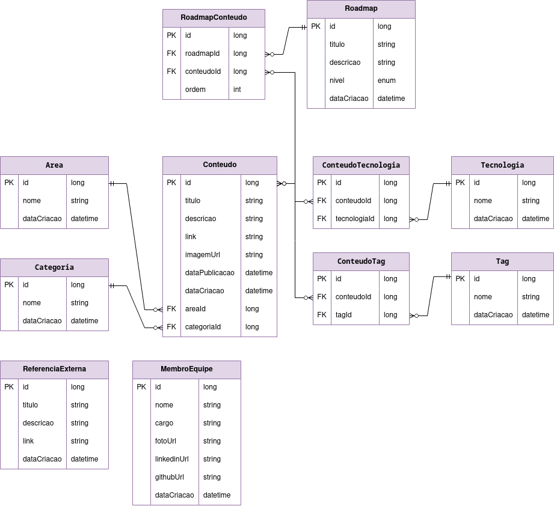

## Diagrama Entidade-Relacionamento

### Descrição
O sistema foi modelado para suportar uma estrutura flexível de conteúdos educacionais e trilhas de aprendizado. Abaixo estão detalhadas as relações e suas regras de negócio.

#### Relações do Sistema

| Entidade A | Cardinalidade | Entidade B | Descrição |
| :--- | :---: | :--- | :--- |
| **Area** | $1:N$ | **Conteudo** | Uma área agrupa vários conteúdos. |
| **Categoria** | $1:N$ | **Conteudo** | Uma categoria classifica vários conteúdos. |
| **Roadmap** | $1:N$ | **RoadmapConteudo** | Um roadmap possui vários itens na trilha. |
| **Conteudo** | $1:N$ | **RoadmapConteudo** | Um conteúdo pode compor vários roadmaps. |
| **Conteudo** | $1:N$ | **ConteudoTecnologia** | Um conteúdo pode estar vinculado a várias tecnologias. |
| **Tecnologia** | $1:N$ | **ConteudoTecnologia** | Uma tecnologia pode ser referenciada em vários conteúdos. |
| **Conteudo** | $1:N$ | **ConteudoTag** | Um conteúdo pode receber diversas tags de classificação. |
| **Tag** | $1:N$ | **ConteudoTag** | Uma tag pode ser aplicada a múltiplos conteúdos. |

---

### Notas de Implementação

> **Resolução de Muitos-para-Muitos ($N:M$):**
> As tabelas `RoadmapConteudo`, `ConteudoTecnologia` e `ConteudoTag` funcionam como **entidades associativas**. Elas foram criadas para resolver as relações de muitos-para-muitos entre as entidades principais, garantindo a escalabilidade do MVP conforme definido na **[US1]**.
>
> **Entidades Independentes:**
> As entidades `ReferenciaExterna` e `MembroEquipe` operam de forma independente, sem chaves estrangeiras vinculadas às outras tabelas de conteúdo.

### Diagrama
